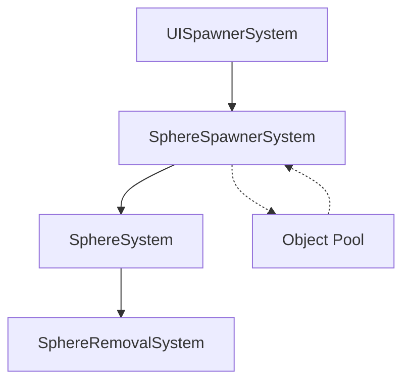

The **Unity ECS Sphere Spawner** project is an advanced demonstration of Unity's Entity Component System (ECS), aimed at efficient object management and performance optimization. Here’s a detailed overview of the features, architecture, and usage:

---

### **Core Features**
1. **High Performance**: Efficient handling of tens of thousands of objects.
2. **ECS Pooling System**: Optimized spawning and recycling of spheres.
3. **Mobile Optimization**: Performance and graphics tailored for mobile devices.
4. **Interactive UI**:
   - Real-time spawn control.
   - Dynamic configuration of spawn rates and counts.
5. **Burst-Compilation**: Maximized CPU performance with Unity Burst Compiler.
6. **Dynamic Movement**: Spheres feature velocity-based movement with decay.

---

### **Architecture**
#### **Key Components**
- **`SphereComponent`**: Stores movement data for spheres.
- **`UISpawnerComponent`**: Handles spawn rate, count, and other controls.
- **`SpherePoolComponent`**: Manages object pooling for efficient reuse.
- **`SceneOptimizer`**: Optimizes settings like draw distance and shadow quality.

#### **Key Systems Workflow**

- **UISpawnerSystem**: Handles UI interactions.
- **SphereSpawnerSystem**: Spawns spheres based on user input.
- **SphereSystem**: Updates sphere positions dynamically.
- **SphereRemovalSystem**: Manages object recycling.

---

### **Performance Highlights**
- **Burst Compilation**: Reduces CPU workload for transformations and calculations.
- **Object Pooling**: Reuses spheres to minimize garbage collection overhead.
- **Mobile Graphics Adjustments**:
  - Disabled HDR and MSAA.
  - Limited shadow quality and skinned mesh complexity.
  - Reduced draw distance (30 units).
  - Optimized LOD (Level of Detail) settings.

---

### **UI Controls**
- **Spawn Button**: Instantly spawns new spheres.
- **Remove Button**: Clears active spheres.
- **Count Adjuster**: Set the number of spheres to spawn.
- **Spawn Rate Slider**: Modify the spawn rate per frame.
- **Live Counter**: Displays the current active sphere count.

---

### **Setup Instructions**
1. Clone the repository.
2. Open the project in **Unity 2022.3** or newer.
3. Install these required Unity packages:
   - **Entities**
   - **Burst**
   - **Mathematics**
   - **Transforms**
4. Open the demo scene.
5. Hit the "Play" button to start.

---

### **Project Structure**
```
Assets/
├── Scripts/
│   ├── Components/
│   │   ├── SphereComponent.cs
│   │   ├── UISpawnerComponent.cs
│   │   └── SpherePoolComponent.cs
│   ├── Systems/
│   │   ├── SphereSystem.cs
│   │   ├── SphereSpawnerSystem.cs
│   │   └── UISpawnerSystem.cs
│   ├── Authoring/
│   │   ├── UISpawnerAuthoring.cs
│   │   └── SphereSpawnerAuthoring.cs
│   └── Optimization/
│       └── SceneOptimizer.cs
```

---

### **Performance Guidelines**
- **Target FPS**: 60 frames per second.
- **Recommended Sphere Count**: ≤ 50,000.
- **Minimum Hardware**:
  - **GPU**: Tier 1 Graphics support.
  - **CPU**: Quad-core or better.
  - **Memory**: At least 4 GB.

---

### **Technical Systems**
#### **Spawn System**
- **Entity Command Buffer**: Batch instantiation for reduced overhead.
- **Randomization**: Generates varied initial positions and velocities.
- **Adjustable Rate**: Dynamic spawn configuration per frame.
- **Target Count**: Stops spawning once the set number of spheres is reached.

#### **Movement System**
- **Physics Simulation**: Velocity-based updates with decay.
- **Random Directions**: Creates diverse movement paths.
- **Efficient Transforms**: Burst-compiled calculations ensure minimal lag.

---

This Unity ECS project serves as an excellent starting point for building high-performance, large-scale object management systems in Unity. It is ideal for use in simulations, games, or other interactive environments requiring scalable object management.
